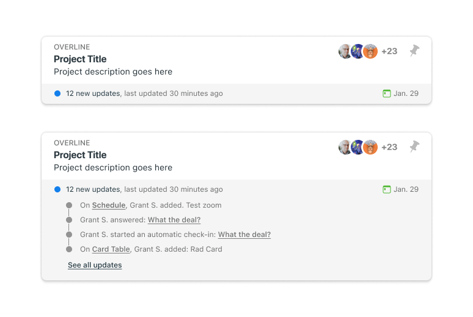
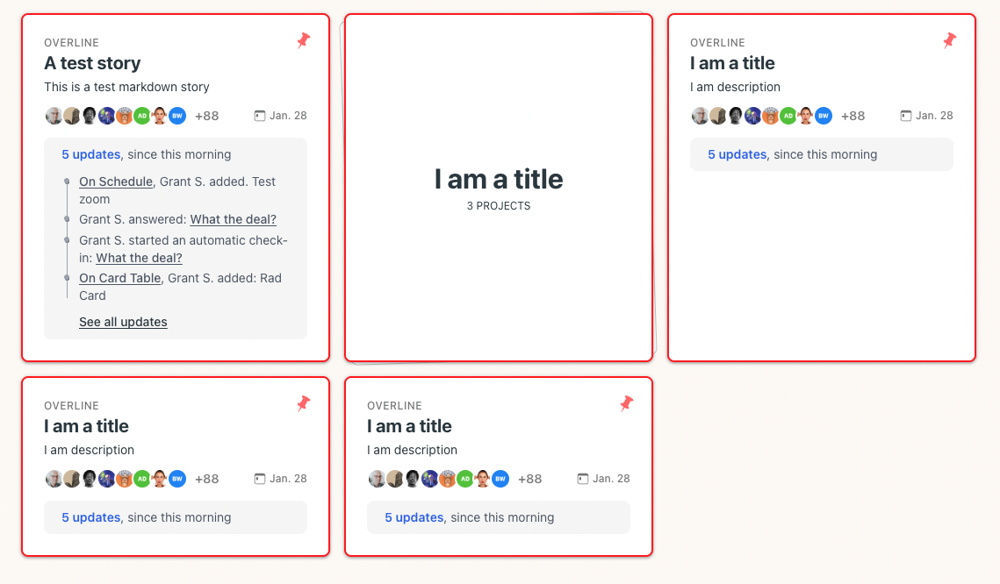

Welcome to my _new blog_ about learning Astro! Here, I will share my learning journey as I build a new website.xxxx

This has been a fun project. Y'all will decide whether I brought enough ...

## Goals

1. **Make the home screen more dynamic**: xxxx.

2. **Give users more control**: Through out the rest of Basecamp, users have simple easy ways to customize their project management to the needs of their organization. I wanted to find ways to add customization into the Home.

3. **Make it feel like Basecamp**: It would be _easy_ to build a a Home screen or (ahem) Dashboard experience that looked like every other product, but that wouldn't be Basecamp. I constantly asked myself if this still

## Discovery

1. Poking around Basecamp

2. Interviewing three Basecamp customers

3. Looking for inspiration

## Computering

### Not feeling the vibe

1. Looked for ways to insert _vibe coding_ into my workflow

2. More trouble than it's worth

3. Blah

### A Command Center

1. For most of this project I was calling this Command Center. It's the name of the repo, the url I shared, and it was the title on the home screen. Saturday (I think it was) I realized that

### What I learned

1. Stuff

### What would I change

1. Probably a lot of it

2. There's interesting potential

3. Rather than the weird resizing area, I'd probably circle back to that and create some predefined layout types that would give users flexibility without some of the weirdness of

### What I've accomplished

1. **Installing Astro**: First, I created a new Astro project and set up my online accounts.

2. **Making Pages**: I then learned how to make pages by creating new `.astro` files and placing them in the `src/pages/` folder.

3. **Making Blog Posts**: This is my first blog post! I now have Astro pages and Markdown posts!

## What's next

I will finish the Astro tutorial, and then keep adding more posts. Watch this space for more to come.

I will finish the Astro tutorial, and then keep adding more posts. Watch this space for more to come.

I will finish the Astro tutorial, and then keep adding more posts. Watch this space for more to come.

