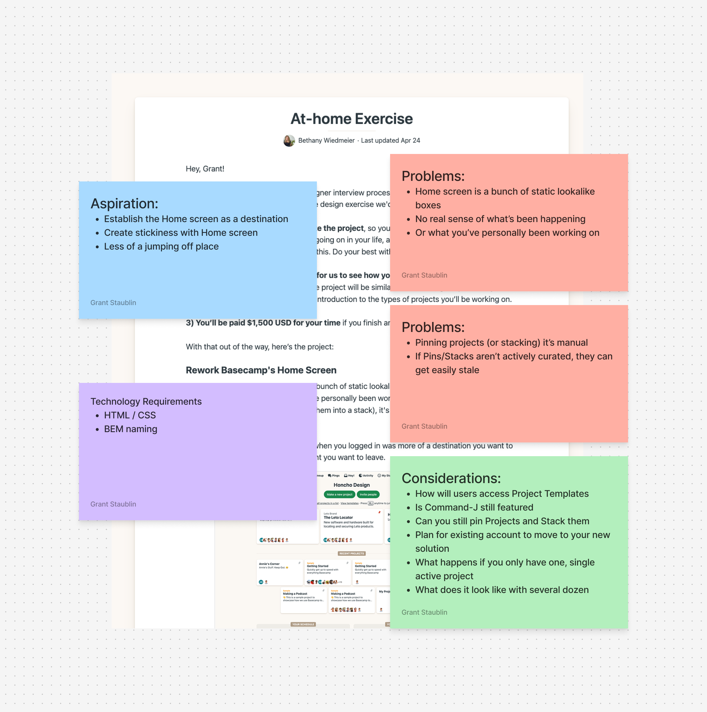

What is Home Base?

Home Base is the Basecamp home screen you’ve known and loved for years, with more control and dynamic data. It’s built to suit your preferred workflow. In a world where you’re switching between pings, comments and assigned tasks and tracking this flurry of activity in multiple browser tabs, Home Base is the Basecamp companion you didn’t know you needed until now ...

👋 Hi all. Sorry for the poorly written promotional hype.

I have about five hours left on my design challenge shot clock, so I’ll to keep myself on topic and keep this informative, yet succinct.

I’ll also prioritize the relevant information first, and allow you to skip sections or close the tab when you’ve had enough.

This has been a fun and challenging project.

Let’s get into the details.

## Goals of Home Base

I gave myself a few goals to stay honest and on track.

1. **Basecamp-like experience**: I wanted it to feel like Basecamp. I avoided creating a typical generic Home screen or Dashboard experience. I wanted to identify improvements without compromising Basecamp’s visual soul.

2. **User control**: Basecamp’s Home screen lacks customization compared to other parts of the product. I wanted to insert that spirit into Home Base.

3. **Create a home users don’t want or need to leave**: I spoke to three Basecamp customers to better understand how the Home screen typically factors into their workflow.

4. **Create something shippable**: I'm not saying this is shippable. It's definitely not. But I wanted to create something that felt at home within Basecamp. There's plenty of thinking left to do, but I think there's something in here ... maybe.

## Home Base at a glance

Here's a quick run down of the features of Home Base

### Preserving Pinned Cards + Stacks

Clearly, I didn't change the Pinned area of the Home screen. Based on gut instinct, I feel like the Pinned area is an important organizing tool for users. If I took it away in the prototype, I feel like, it would either need to be brought back, or we'd need to create a new feature to give people a space like the current Pinned area. Again, this is purely a gut feeling that might likely be wrong.

Also, this in process image(above) shows the fundamental problem that exists with my next idea streaming updates into the project cards. With the current solution, things get wonky when a user clicks on the updates available within one Pinned project.

This is one of the many things I considered changing or finding a better alternative for. I didn't want to create a Home Screen full of popovers, which doesn't feel like Basecamp. So for now, this idea stands, waiting for a better option.

### Data flowing into Project Cards

I spent entirely too much time thinking about the project cards on the Home screen. Rather than coming up with an overall design that completely rethought them, or even removed them, I wanted to find ways of making project cards more informative.

In the visual design process, I also started with the horizontal card, which ultimately became an issue when I decided to preserve the Pinned area.

I had another early idea to surface notication dots on cards (below). I didn't like that this only showed you that there were updates, rather than there being updates you can glance at and decide whether you needed glance at.

- **Due Dates:** If a project has due date associated with it, the calendar appears. I also toyed around with ideas to surface the Needle on the card, but ultimately landed on an idea where the calendar can be color coded according to Needle status. It's a subtle nod.

- **Updates:** I feel like the success of this idea could depend on the organization and the metabolism of their projects. Updates within project cards could easily turn into a loud mess.

- **People:** At various points in my process, I removed the people from project cards. I kept coming back to them. There's an interesting visual rhythm when you're scanning projects on your home screen. Seeing a three person projects next to a 40 person project indicates a sense of priority or importance.

## More control over recents

I think it was Saturday morning when I finally figured out the organizing principle of the Recent section. This was, coincidentally, the morning I upgraded from a free account to a paid account. I guess if I wasn't so cheap, I would have figured that out on day 1 rather than day 5.

I conducted three customer conversations early in my process, and they all immediately jumped to all projects when they wanted to find something. I began wondering how we might insert some control into the recents. The thinking behind the custom option is that a user would be able to reorganize the list of projects as they preferred, which might honestly be too much like Pinned.

### Granular Feeds

Early on, I was thinking about a more standard feed, that flows in all the information with the requisite controls to remove all of a given content type like, say, comments. I kept wondering if there was a meaningful way to surface a specific content type from one project and another specific content type from a different project.

### The Resizer

This is an interesting idea. If I wasn't three hours from deadline, I likely would be ripping this out and replacing it with some sort of layout chooser that maintains the spirit of the resizer in a potentially more logical manner. Still, I like the option of giving the user control.

## The Process

### Discovery (Days 1 – 3)

When I received the challenge Tuesday morning, I read it a few times. I went for a long walk and talked to myself alot. I quickly decided I wanted to talk to some real users, and see how they use Basecamp on daily basis.

My wife and her team at Curry College use Basecamp so I was easily able to have a few conversations by Thursday afternoon.

Over the first couple days, there wasn't a lot of _design_ happening outside of scribbled notes and low-fi ink sketches. I guess the real design process kicked off Friday.

### Design + Build (Days 4 – 7)

Most design was done in the browser. I did some rough sketches in Figma to get a sense where I thought I wanted to go. The only real bit of visual design I worked out in Figma was fleshing out how the horizontal card (below) would look and act.

### Not feeling the vibe

For the bits of design I created in Figma, like the horizontal card, I attempted to upload a screen shot of my design into Vercel's v0. This was an interesting experiment. It quickly spit something out something I could see in the browser. But, I probably spent more time re-writing and re-naming and re-structing that code than if I'd skipped this experiment. As interesting as the AI tools are, in this case, it didn't feel worth the effort.

On the other hand, The Resizer JS **is** copy pasta. I looked at it a couple times, thinking I'd take a crack at rewriting it, but more prevailing priorities took precedence. I seriously considered just ripping that out, but left it in as a conceptual idea, even if it doesn't represent _my work_.

## Name change

For most of this project I was calling this Command Center. It's the name of the repo, the url I shared, and it was the title on the home screen. Saturday morning, I realized that Mission Control exists. I knew I wanted to find a better name for this. It wasn't until Monday morning, that I came up with Home Base.

## Tech Details

I used Astro to build this. This makes it create partials or components that can be easily be shared across multiple files without opting to any kind of JS framework nonsense. If I had been really adventurous I would have attempting spinning this up as a Rails app. I wasn't that adventurous though.

## Wrapping it up

Hopefully, this offers a good view into my thinking and process. I'm happy to answer any questions or clarify anything that's unclear.

Other than that, thank you for reading!
